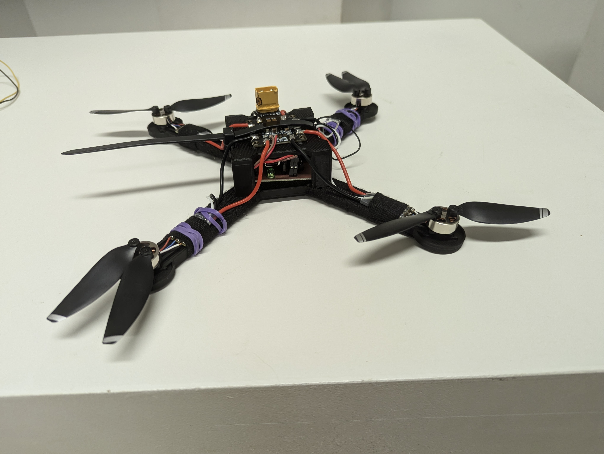
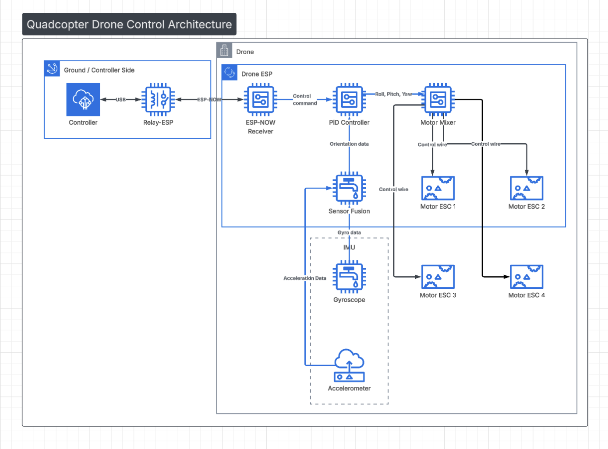
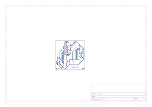
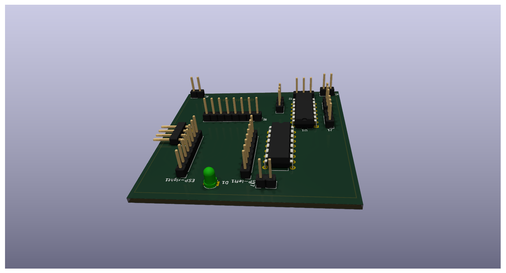

# Project quadstorm (C010 Principles of Mobile Robotics)

## Architecture

## Mainboard

## Parts-List:
- [BT2.0 550mAh 1S Battery](https://betafpv.com/products/bt2-0-550mah-1s-battery-4pcs#:~:text=Weight:%2013.99g/pc,VS%20450mAh%20Battery)
- IMU [BMI323](https://www.bosch-sensortec.com/products/motion-sensors/imus/bmi323/)
- Motors: [4x 2S Bldc 1503](https://www.amazon.de/dp/B0CK2KT3R3)
- ESP32-C6 ([ESP32-C6 Supermini](https://wiki.raudys.com/doku.php?id=esp32:esp32-c6_super_mini_board) / [DFR1117](https://wiki.dfrobot.com/SKU_DFR1117_Beetle_ESP32_C6))
- 74LS04 (Hex-Inverter), 74LS138 3-to-8 demux)
- [FVT LittleBee ESC 20A 2-4S](https://de.aliexpress.com/item/1005010298051292.html)
- Generic DJI compatible props
- 3d Printed Frame
- Custom Mainboard (manufactured via CNC Router)
- 12 M2x8 Screws
