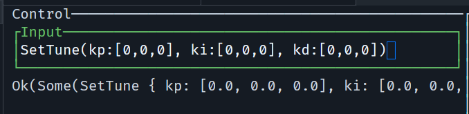
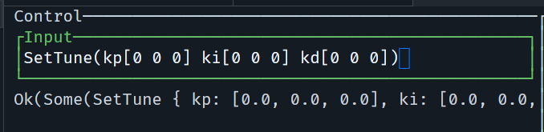
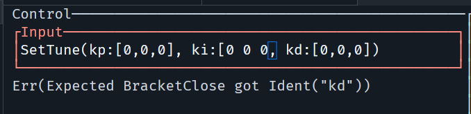

# Remote TUI

## How to run

1. compile, flash and run `remote-relay` (has to be connected to `USB0`, probe-rs has to be detached)

2. compile, flash and run `drone` (can be connected to `USB1`, probe-rs can stay connected)
 
3. compile and run `remote-terminal`

```bash
> cd remote-terminal
> cargo r -- ../target/riscv32imac-unknown-none-elf/release/remote ../target/riscv32imac-unknown-none-elf/release/drone
```

## Controls

- `1`: Show remote internal logs tab
- `2`: Show relay logs tab
- `3`: Show drone logs tab
- `i`: Enable message repl editing
- `Enter`: Send message in repl buffer (focuses log tabs again)
- `Esc`: Leave current context (repl or quit tui)
- `q`: Quit tui (does not work when in repl so that you can type the letter q)

## Repl

Parsing implementation can be found in `src/control_tab.rs` > `parse_input`. 

- whitespace is ignored (but can matter for separating tokens)
- `commas` and `colons` are optional
- floats can be written like this: `0`, `0.0`, `.0`, `0.`
- bools are written like this: `false`, `true`
- arrays can be written like this: `[0 0 0]`, `[0,0,0]`, `[0,0,0,]`, `[0 0,0,]`, etc.
- examples for messages are:
  - `Ping`
  - `SetArm(true)`, `SetArm(false)`
  - `ArmConfirm`
  - `SetThrust(0)`, `SetThrust(27.9)`
  - `SetTarget([1.5 2.5 6.7])`, `SetTarget([1.5, 2.5, 6.7])`, etc.
  - `SetTune(kp[0 3 9] ki[0 0 1] kd[5 5 0])`, `SetTune(kp: [0 3 9], ki: [0 0 1], kd: [5 5 0])`, etc.





